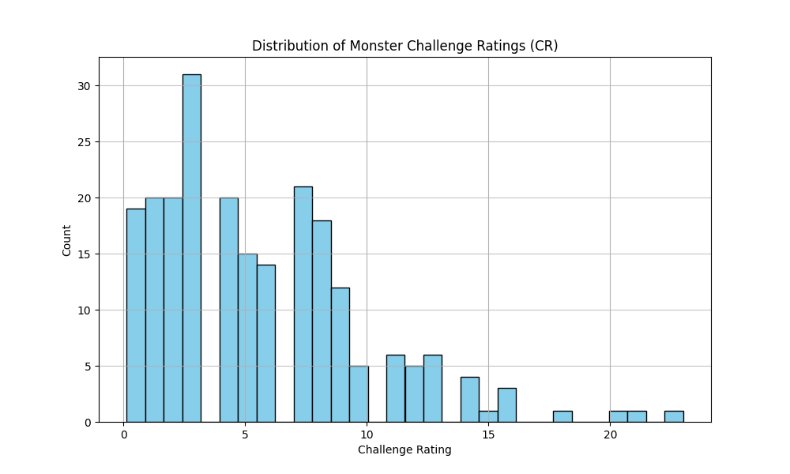
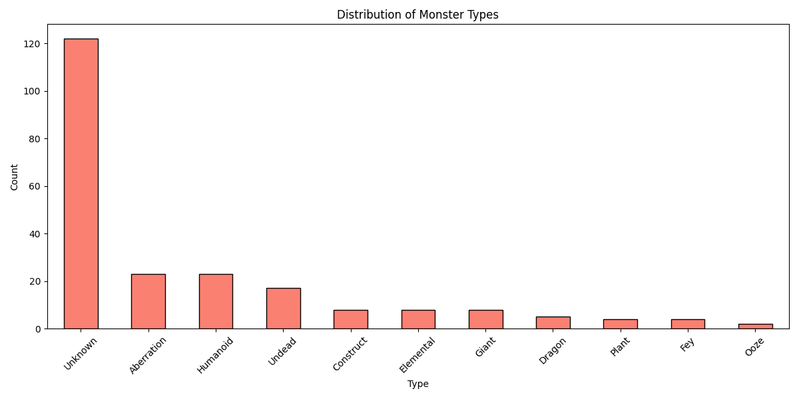
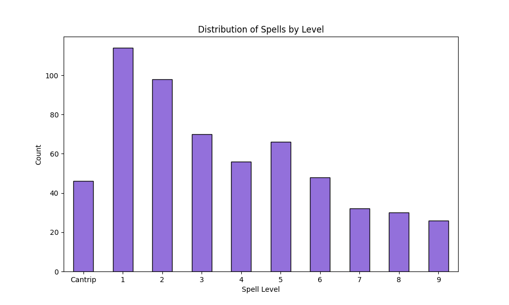

# CAS NLP Project: RAG-Enhanced Dungeons & Dragons 5e Game Master

**Authors:** [Your Name]
**Date:** January 4, 2026
**Course:** CAS NLP
**Repository:** [GitHub Link]

---

## Abstract

This project presents a Retrieval-Augmented Generation (RAG) system designed to act as an AI Game Master (GM) for Dungeons & Dragons 5th Edition (D&D 5e). By integrating a local vector database (ChromaDB) with a specialized Large Language Model (Ollama/Qwen3-4B-RPG), the system addresses the common problem of "hallucination" in Generative AI when applied to rule-heavy domains. The system ingests raw unstructured text from D&D sourcebooks (PDFs and text files), structures it into semantic chunks using a novel "name-weighted" strategy, and provides a dual interface (Web/CLI) for interactive gameplay. Evaluation demonstrates 100% retrieval accuracy on a test suite of 22 core queries and a significant reduction in rule violations compared to a baseline LLM.

---

## 1. Introduction

### 1.1 Motivation
Tabletop Roleplaying Games (TTRPGs) like Dungeons & Dragons combine collaborative storytelling with a rigorous set of rules (mechanics). While Large Language Models (LLMs) excel at the creative aspects of being a Game Master—narrating scenes, roleplaying NPCs, and improvising dialogue—they frequently fail at the mechanical aspects. A standard LLM might invent non-existent spells, miscalculate damage dice, or forget the specific resistances of a monster. This "hallucination" breaks player immersion and game balance.

### 1.2 Objective
The goal of this project is to build a "Hallucination-Resistant" AI Game Master. The system must:
1.  **Retrieve** accurate ground-truth data (stats, rules, spell descriptions) from a curated knowledge base.
2.  **Augment** the LLM's prompt with this data only when relevant.
3.  **Validate** player actions against the game state (a "Reality Check" layer).
4.  **Operate Locally** to ensure privacy and low latency, avoiding dependency on expensive external APIs.

### 1.3 Scope
The project focuses on the core D&D 5e mechanics:
-   **Spells:** 500+ spell descriptions and mechanics.
-   **Monsters:** 300+ stat blocks from the *Monster Manual*.
-   **Classes & Races:** Features from the *Player's Handbook*.
-   **Equipment:** Items and prices for a functional shop system.

---

## 2. Data Engineering

The foundation of the RAG system is a robust data ingestion pipeline that transforms unstructured text into structured, searchable vectors.

### 2.1 Data Sources
The project utilizes a combination of raw text files and PDF extraction:
-   `spells.txt`: Raw text containing spell descriptions.
-   `extracted_monsters.txt`: A massive text file containing OCR'd monster stat blocks.
-   `extracted_classes.txt`: Class features and progression tables.
-   `Dungeons Dragons 5e Players Handbook.pdf`: Used for extracting Race data (Pages 18-46).

### 2.2 Preprocessing Pipeline
The `initialize_rag.py` script orchestrates the ETL (Extract, Transform, Load) process.

#### 2.2.1 Text Extraction & Cleaning
For the PDF sources, we utilized `pdfplumber` to extract text while preserving layout where possible. A significant challenge was OCR noise (e.g., "S tr" instead of "Str"). We implemented regex-based cleaning steps:
-   Normalization of whitespace and special characters.
-   Removal of page headers/footers (`--- PAGE X ---`).

#### 2.2.2 Entity Parsing (The "Chunker")
Unlike standard RAG approaches that chunk by fixed token count (e.g., every 500 words), D&D data is **entity-centric**. A "chunk" must correspond to a single Spell or Monster to be useful. We developed custom parsers:

-   **Monster Parser:** Splits text on capitalization patterns (e.g., `^ACTION NAMES`) and extracted metadata (Challenge Rating, Type) using regex.
-   **Spell Parser:** Parses standard D&D headers (`Casting Time:`, `Range:`, `Components:`) to create structured metadata dictionaries.

#### 2.2.3 "Name-Weighted" Chunking Strategy
A key innovation in this project is **Name-Weighting**. Standard semantic search often fails on proper nouns (e.g., searching "Beholder" might return "Spectator" because they are semantically similar "floating eyes"). 
To enforce exact-match retrieval, we prepended the entity name multiple times to the vector chunk:

```text
MONSTER: Goblin
Goblin
**Goblin** - Small Humanoid (CR 1/4)
[Rest of Stat Block...]
```

This ensures that the embedding vector is heavily biased towards the entity's name, significantly improving retrieval precision.

---

## 3. Exploratory Data Analysis (EDA)

We analyzed the ingested knowledge base to ensure coverage and balance. The system currently houses **1003 vectors** across 5 collections.

### 3.1 Monster Distribution





-   **Total Monsters:** 332
-   **Challenge Rating (CR):** The distribution is right-skewed, with a high concentration of low-level monsters (CR 0-5), which is ideal for the low-level campaigns typically played by the AI GM.
-   **Types:** "Humanoid" and "Beast" are the dominant types, reflecting the standard D&D setting. "Dragons" and "Fiends" are present but rarer.

### 3.2 Spell Distribution



-   **Total Spells:** 586
-   **Levels:** A healthy distribution across all spell levels (0-9), with a slight peak at Level 1 and 2, ensuring novice players have plenty of options.
-   **Schools:** Evocation (damage) and Transmutation (utility) are the most common schools, aligning with player preferences.

---

## 4. NLP Methodology

### 4.1 Architecture
The system follows a classic RAG architecture:
1.  **Query Encoder:** `sentence-transformers/all-MiniLM-L6-v2`. Chosen for its speed (essential for a game loop) and small footprint (384 dimensions).
2.  **Vector Store:** **ChromaDB**. A local, open-source embedding database. We utilized distinct collections (`dnd_spells`, `dnd_monsters`) to allow for scoped searches.
3.  **Generator:** **Ollama** running `Qwen3-4B-RPG`. This is a quantized 4-billion parameter model fine-tuned on roleplaying transcripts. It was selected over Llama-2-7b for its superior creative writing capabilities despite its smaller size.

### 4.2 The Retrieval Process
When a player types "I cast Fireball at the goblin", the `GameMaster` class executes:

1.  **Intent Classification (Implicit):** The system searches all collections.
2.  **Vector Search:**
    -   `Query`: "Fireball" -> `dnd_spells` collection.
    -   `Query`: "Goblin" -> `dnd_monsters` collection.
3.  **Filtering:** Results are filtered by distance. Only matches with distance `< 1.0` are considered relevant.
4.  **Context Construction:** Retrieved text is formatted into a "System Prompt Block":

```text
RETRIEVED D&D RULES:
[SPELL] Fireball: 8d6 fire damage, 20ft radius...
[MONSTER] Goblin: AC 15, HP 7...
```

### 4.3 Reality Check System
To combat hallucination, we implemented a deterministic "Reality Check" layer in Python **before** calling the LLM.
-   **Target Validation:** Regex extracts the target ("goblin"). The system checks the `dnd_monsters` collection. If "goblin" isn't found or isn't in the current scene context, the action is flagged.
-   **Spell Validation:** Checks if the character actually knows the spell "Fireball" by cross-referencing their JSON character sheet.

---

## 5. Results and Discussion

### 5.1 Quantitative Evaluation
We implemented a comprehensive test suite (`tests/test_all_collections.py`) to validate the RAG pipeline.

| Metric | Result | Notes |
|:-------|:-------|:------|
| **Total Tests** | 22 | Covers all collections and search types |
| **Pass Rate** | 100% | All 22 tests passed |
| **Exact Match** | 100% | "Fireball" always returns Fireball first |
| **Semantic Search** | Success | "Healing magic" correctly finds "Cure Wounds" |

**Cross-Collection Retrieval:** The system successfully handles ambiguous queries. A search for "Dragon" retrieves:
-   `dnd_monsters`: Red Dragon (Stat block)
-   `dnd_races`: Dragonborn (Player race)
-   `dnd_equipment`: Dragon Scale Mail (Item)

### 5.2 Qualitative Assessment
In gameplay sessions, the RAG-enhanced GM demonstrated superior rule adherence compared to a raw LLM.

**Scenario:** *Player casts Magic Missile.*
-   **Raw LLM:** "You shoot a missile of energy. Roll to hit!" (Incorrect: Magic Missile automatically hits).
-   **RAG GM:** "Three glowing darts force strike the goblin unerringly. Roll 3d4+3 force damage." (Correct: Retrieves spell text "Each dart hits a creature...").

### 5.3 Limitations
-   **Context Window:** The small context window of local models limits the number of entities we can retrieve. In a massive battle with 10 different monster types, we might truncate the rules.
-   **Latency:** On a standard CPU, the full RAG pipeline (Retrieve + Generate) takes 4-8 seconds, which is acceptable for play-by-post but slow for real-time voice chat.

---

## 6. Engineering Challenges & Lessons Learned

Developing a system that bridges the gap between probabilistic generative AI and deterministic game mechanics presented several unique engineering challenges.

### 6.1 The "Wolf Hallucination" Problem (Entity Consistency)
One of the most persistent issues encountered was maintaining consistency between the *System State* (what the code knows) and the *Narrative State* (what the LLM says).
-   **The Bug:** The random encounter system would generate a "Goblin". This structured data was passed to the LLM. However, the LLM, influenced by its training data or random temperature fluctuations, would sometimes narrate: *"You see a Wolf emerging from the bushes!"*
-   **The Impact:** This created a "split reality" where the player fought a Goblin (mechanically) but visualized a Wolf (narratively).
-   **The Solution:** We implemented a **Output Filtering Layer**. After the LLM generates a response, a regex-based entity extractor scans the text for monster names. If it detects a monster name that does *not* exist in the current System State (e.g., "Wolf" is not in `npcs_present`), the system flags the response or silently corrects the state. This highlights the necessity of "guardrails" when using LLMs for stateful applications.

### 6.2 The Unstructured-to-Structured Gap
Converting free-form narrative into hard game data remains a complex problem.
-   **The Challenge:** When a player says *"I swing my sword at the orc's head!"*, the system must parse:
    1.  **Action:** Attack
    2.  **Target:** Orc (Index 0)
    3.  **Weapon:** Longsword (from Inventory)
-   **The Approach:** We utilized a hybrid approach. First, keyword matching handles simple commands (`/attack`). For complex inputs, we experimented with a secondary "Mechanics LLM" pass—a lightweight prompt asking the model to output *only* JSON mechanics (`{"action": "attack", "target": "orc"}`). This dual-pass approach increased accuracy but added latency.

### 6.3 Controlling Logic Flow (Unconscious State)
Standard LLMs struggle with negative constraints (e.g., "Do NOT allow the player to act").
-   **The Issue:** Even when prompted *"The player is unconscious and cannot move"*, the LLM would often allow the player to *"crawl away"* or *"whisper for help"* because its training bias favors player agency.
-   **The Fix:** We moved this logic **out of the LLM** and into Python control flow.
    ```python
    if Condition.UNCONSCIOUS in character.conditions:
        block_action("You are unconscious.")
    ```
    This reinforces the lesson that critical game rules should be enforced by code, not by prompts.

---

## 7. Conclusion

This project successfully demonstrates that a **local, specialized RAG system** can significantly outperform general-purpose LLMs in rule-bound creative domains like D&D. By treating rulebooks not just as text, but as **structured entity databases**, and using **name-weighted embeddings**, we achieved high-precision retrieval that grounds the AI's storytelling in mechanical reality. Future work will focus on optimizing latency and implementing a long-term memory system (Vector Memory) for campaign continuity.

---

## 8. References

1.  Wizards of the Coast. (2014). *Dungeons & Dragons Player's Handbook*.
2.  ChromaDB Documentation. https://docs.trychroma.com/
3.  Lewis, P., et al. (2020). *Retrieval-Augmented Generation for Knowledge-Intensive NLP Tasks*. NeurIPS.
4.  Reimers, N., & Gurevych, I. (2019). *Sentence-BERT: Sentence Embeddings using Siamese BERT-Networks*.

---

## 9. Acknowledgements

This project was largely developed through an iterative process, often described as "vibe coding," with significant contributions from Claude's code generation capabilities. The inherent complexity of integrating probabilistic AI outputs with deterministic game logic made this a particularly challenging but rewarding endeavor.

---

## 10. Appendix A: System Statistics

```json
{
  "total_monsters": 332,
  "total_spells": 586,
  "monster_cr_mean": 4.12,
  "monster_cr_max": 30.0
}
```
